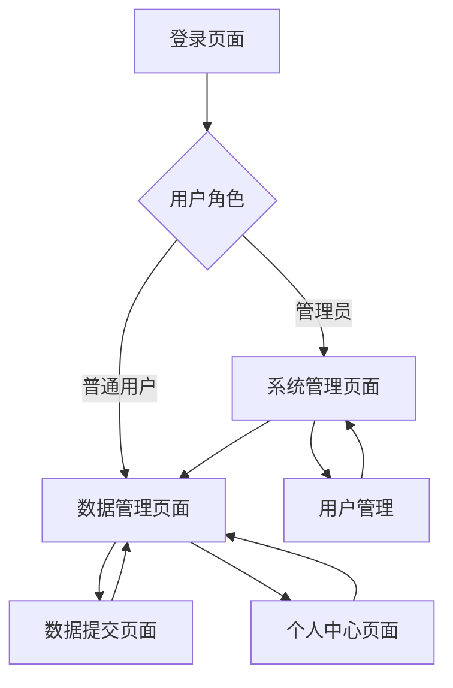

# 数据采集平台产品需求文档

## 1. 产品概述

数据采集平台是一个专门用于管理和处理来自多个电商平台图片数据的管理系统，支持数据的提交、分配、领取和状态跟踪。
该平台采用前后端分离架构，为管理员和普通用户提供不同权限的操作界面，实现高效的数据采集工作流程管理。
目标是提高数据采集效率，减少重复工作，确保数据质量和可追溯性。

## 2. 核心功能

### 2.1 用户角色

| 角色 | 注册方式 | 核心权限 |
|------|----------|----------|
| 管理员 | 系统预设或超级管理员创建 | 用户管理、数据管理、系统配置、数据统计查看 |
| 普通用户 | 邮箱注册或管理员邀请 | 数据提交、数据领取、个人数据查看 |

### 2.2 功能模块

数据采集平台包含以下主要页面：
1. **登录注册页面**：用户身份验证，角色识别
2. **数据管理页面**：数据列表展示、筛选、状态管理
3. **数据提交页面**：新数据录入、批量导入
4. **个人中心页面**：用户信息管理、操作历史
5. **系统管理页面**：用户管理、系统配置（仅管理员）

### 2.3 页面详情

| 页面名称 | 模块名称 | 功能描述 |
|----------|----------|----------|
| 登录注册页面 | 用户认证 | 用户登录验证、新用户注册、密码重置 |
| 数据管理页面 | 数据列表 | 显示所有数据记录、支持按平台、状态、提交人筛选 |
| 数据管理页面 | 数据操作 | 数据领取、标记完成、标记重复、批量操作 |
| 数据提交页面 | 单条提交 | 手动输入图片URL、选择来源平台、填写平台ID |
| 数据提交页面 | 批量导入 | Excel文件上传、数据格式验证、批量处理 |
| 个人中心页面 | 用户信息 | 查看和编辑个人资料、修改密码 |
| 个人中心页面 | 操作历史 | 查看个人提交记录、领取记录、完成统计 |
| 系统管理页面 | 用户管理 | 用户列表、角色分配、用户状态管理（仅管理员） |
| 系统管理页面 | 数据统计 | 平台数据统计、用户活跃度、完成率分析（仅管理员） |

## 3. 核心流程

**普通用户流程：**
用户登录 → 查看可领取数据 → 领取数据 → 处理数据 → 标记完成状态 → 提交新数据（可选）

**管理员流程：**
管理员登录 → 查看系统概况 → 管理用户权限 → 监控数据处理进度 → 处理异常数据 → 生成统计报告

## 4. 用户界面设计

### 4.1 设计风格

- **主色调**：#165DFF（Arco Design 主蓝色）、#F7F8FA（背景灰）
- **辅助色**：#00B42A（成功绿）、#FF7D00（警告橙）、#F53F3F（错误红）
- **按钮样式**：圆角按钮，主要按钮使用实心样式，次要按钮使用线框样式
- **字体**：系统默认字体，标题使用16px-20px，正文使用14px，辅助文字使用12px
- **布局风格**：卡片式布局，左侧导航栏，顶部面包屑导航
- **图标风格**：使用Arco Design图标库，线性风格图标

### 4.2 页面设计概览

| 页面名称 | 模块名称 | UI元素 |
|----------|----------|---------|
| 登录注册页面 | 登录表单 | 居中卡片布局，蓝色主题，输入框带图标，记住密码选项 |
| 数据管理页面 | 数据表格 | 表格组件，分页器，筛选器，操作按钮组，状态标签 |
| 数据管理页面 | 筛选面板 | 下拉选择器，日期选择器，搜索框，重置按钮 |
| 数据提交页面 | 提交表单 | 表单布局，文件上传组件，平台选择器，验证提示 |
| 个人中心页面 | 信息卡片 | 用户头像，信息展示卡片，统计数字卡片 |
| 系统管理页面 | 管理面板 | 标签页切换，数据统计图表，用户管理表格 |

### 4.3 响应式设计

桌面优先设计，支持平板和移动端适配，在小屏幕设备上侧边栏收缩为抽屉式导航，表格支持横向滚动，确保核心功能在移动端可用。