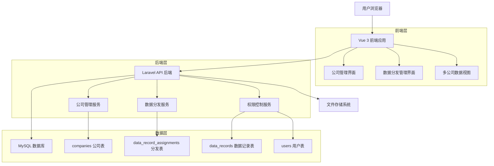
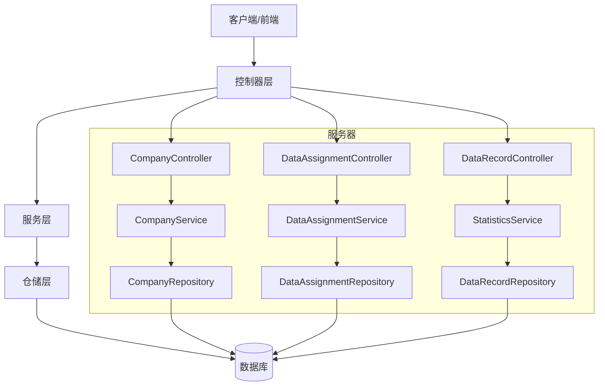
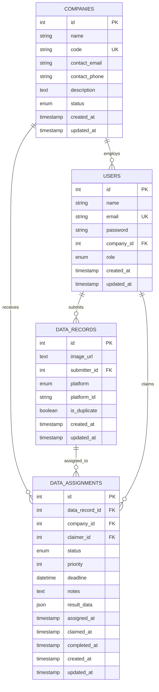

# 多公司数据处理系统技术架构文档

## 1. 架构设计



## 2. 技术描述

- 前端：Vue 3 + Arco Design Vue + TypeScript + Vite
- 后端：Laravel 10 + PHP 8.1+
- 数据库：MySQL 8.0
- 认证：Laravel Sanctum
- 文件存储：Laravel 本地存储

## 3. 路由定义

| 路由 | 用途 |
|------|------|
| /companies | 公司管理页面，显示公司列表和管理功能 |
| /companies/create | 创建公司页面 |
| /companies/:id/edit | 编辑公司信息页面 |
| /data-assignments | 数据分发管理页面，管理数据记录的分发 |
| /data-assignments/create | 创建数据分发页面 |
| /data-records | 数据记录列表页面（支持多公司视图） |
| /statistics/companies | 公司维度统计报表页面 |

## 4. API 定义

### 4.1 公司管理 API

**获取公司列表**
```
GET /api/companies
```

Response:
| 参数名 | 参数类型 | 描述 |
|--------|----------|------|
| id | number | 公司ID |
| name | string | 公司名称 |
| code | string | 公司代码 |
| contact_email | string | 联系邮箱 |
| contact_phone | string | 联系电话 |
| status | string | 状态：active/inactive |
| created_at | string | 创建时间 |

**创建公司**
```
POST /api/companies
```

Request:
| 参数名 | 参数类型 | 是否必填 | 描述 |
|--------|----------|----------|------|
| name | string | 是 | 公司名称 |
| code | string | 是 | 公司代码（唯一） |
| contact_email | string | 否 | 联系邮箱 |
| contact_phone | string | 否 | 联系电话 |
| description | string | 否 | 公司描述 |

### 4.2 数据分发管理 API

**获取数据分发列表**
```
GET /api/data-assignments
```

Query Parameters:
| 参数名 | 参数类型 | 是否必填 | 描述 |
|--------|----------|----------|------|
| company_id | number | 否 | 公司ID筛选 |
| status | string | 否 | 状态筛选：pending/assigned/completed |
| page | number | 否 | 页码 |
| per_page | number | 否 | 每页数量 |

**创建数据分发**
```
POST /api/data-assignments
```

Request:
| 参数名 | 参数类型 | 是否必填 | 描述 |
|--------|----------|----------|------|
| data_record_id | number | 是 | 数据记录ID |
| company_id | number | 是 | 目标公司ID |
| priority | number | 否 | 优先级（1-10） |
| deadline | string | 否 | 截止时间 |
| notes | string | 否 | 备注信息 |

**领取数据分发**
```
POST /api/data-assignments/{id}/claim
```

**完成数据分发**
```
POST /api/data-assignments/{id}/complete
```

Request:
| 参数名 | 参数类型 | 是否必填 | 描述 |
|--------|----------|----------|------|
| result_data | object | 否 | 处理结果数据 |
| notes | string | 否 | 完成备注 |

### 4.3 统计分析 API

**获取公司维度统计**
```
GET /api/statistics/companies
```

Response:
| 参数名 | 参数类型 | 描述 |
|--------|----------|------|
| company_id | number | 公司ID |
| company_name | string | 公司名称 |
| total_assigned | number | 总分发数量 |
| completed_count | number | 已完成数量 |
| pending_count | number | 待处理数量 |
| completion_rate | number | 完成率 |

## 5. 服务器架构图



## 6. 数据模型

### 6.1 数据模型定义



### 6.2 数据定义语言

**公司表 (companies)**
```sql
-- 创建公司表
CREATE TABLE companies (
    id BIGINT UNSIGNED AUTO_INCREMENT PRIMARY KEY,
    name VARCHAR(255) NOT NULL COMMENT '公司名称',
    code VARCHAR(100) NOT NULL UNIQUE COMMENT '公司代码',
    contact_email VARCHAR(255) NULL COMMENT '联系邮箱',
    contact_phone VARCHAR(20) NULL COMMENT '联系电话',
    description TEXT NULL COMMENT '公司描述',
    status ENUM('active', 'inactive') DEFAULT 'active' COMMENT '状态',
    created_at TIMESTAMP DEFAULT CURRENT_TIMESTAMP,
    updated_at TIMESTAMP DEFAULT CURRENT_TIMESTAMP ON UPDATE CURRENT_TIMESTAMP
);

-- 创建索引
CREATE INDEX idx_companies_status ON companies(status);
CREATE INDEX idx_companies_created_at ON companies(created_at);

-- 初始化数据
INSERT INTO companies (name, code, contact_email, description) VALUES
('默认公司', 'DEFAULT', 'admin@example.com', '系统默认公司'),
('测试公司A', 'COMPANY_A', 'contact@companya.com', '测试用公司A'),
('测试公司B', 'COMPANY_B', 'contact@companyb.com', '测试用公司B');
```

**数据分发表 (data_record_assignments)**
```sql
-- 创建数据分发表
CREATE TABLE data_record_assignments (
    id BIGINT UNSIGNED AUTO_INCREMENT PRIMARY KEY,
    data_record_id BIGINT UNSIGNED NOT NULL COMMENT '数据记录ID',
    company_id BIGINT UNSIGNED NOT NULL COMMENT '分发目标公司ID',
    claimer_id BIGINT UNSIGNED NULL COMMENT '领取人ID',
    status ENUM('pending', 'assigned', 'completed', 'cancelled') DEFAULT 'pending' COMMENT '分发状态',
    priority INT DEFAULT 5 COMMENT '优先级(1-10)',
    deadline DATETIME NULL COMMENT '截止时间',
    notes TEXT NULL COMMENT '分发备注',
    result_data JSON NULL COMMENT '处理结果数据',
    assigned_at TIMESTAMP NULL COMMENT '分发时间',
    claimed_at TIMESTAMP NULL COMMENT '领取时间',
    completed_at TIMESTAMP NULL COMMENT '完成时间',
    created_at TIMESTAMP DEFAULT CURRENT_TIMESTAMP,
    updated_at TIMESTAMP DEFAULT CURRENT_TIMESTAMP ON UPDATE CURRENT_TIMESTAMP,
    
    -- 外键约束
    FOREIGN KEY (data_record_id) REFERENCES data_records(id) ON DELETE CASCADE,
    FOREIGN KEY (company_id) REFERENCES companies(id) ON DELETE CASCADE,
    FOREIGN KEY (claimer_id) REFERENCES users(id) ON DELETE SET NULL
);

-- 创建索引
CREATE INDEX idx_assignments_data_record ON data_record_assignments(data_record_id);
CREATE INDEX idx_assignments_company ON data_record_assignments(company_id);
CREATE INDEX idx_assignments_claimer ON data_record_assignments(claimer_id);
CREATE INDEX idx_assignments_status ON data_record_assignments(status);
CREATE INDEX idx_assignments_priority ON data_record_assignments(priority DESC);
CREATE INDEX idx_assignments_deadline ON data_record_assignments(deadline);
CREATE INDEX idx_assignments_created_at ON data_record_assignments(created_at DESC);

-- 复合索引
CREATE INDEX idx_assignments_company_status ON data_record_assignments(company_id, status);
CREATE INDEX idx_assignments_status_priority ON data_record_assignments(status, priority DESC);
```

**修改用户表 (users)**
```sql
-- 为用户表添加公司关联
ALTER TABLE users 
ADD COLUMN company_id BIGINT UNSIGNED NULL COMMENT '所属公司ID' AFTER email,
ADD COLUMN role ENUM('admin', 'manager', 'employee') DEFAULT 'employee' COMMENT '用户角色' AFTER company_id;

-- 添加外键约束
ALTER TABLE users 
ADD CONSTRAINT fk_users_company 
FOREIGN KEY (company_id) REFERENCES companies(id) ON DELETE SET NULL;

-- 创建索引
CREATE INDEX idx_users_company ON users(company_id);
CREATE INDEX idx_users_role ON users(role);

-- 更新现有用户数据（关联到默认公司）
UPDATE users SET company_id = 1 WHERE company_id IS NULL;
```

## 7. 迁移策略

### 7.1 数据迁移步骤

1. **创建新表结构**
   - 创建 companies 表
   - 创建 data_record_assignments 表
   - 修改 users 表添加 company_id

2. **数据迁移**
   - 将现有用户关联到默认公司
   - 为现有的已领取数据记录创建对应的分发记录
   - 保持原有 data_records 表数据不变

3. **API 兼容性处理**
   - 保持原有 API 接口正常工作
   - 新增多公司相关 API 接口
   - 逐步引导使用新的分发机制

### 7.2 向下兼容性

- 原有的数据记录 API 继续支持单一处理模式
- 新的分发 API 支持多公司处理模式
- 前端界面提供切换选项，支持两种模式

## 8. 权限控制

### 8.1 角色权限设计

| 角色 | 权限描述 |
|------|----------|
| admin | 系统管理员，可管理所有公司和数据 |
| manager | 公司管理员，可管理本公司的数据和用户 |
| employee | 普通员工，只能处理分发给自己的数据 |

### 8.2 数据访问控制

- 用户只能看到分发给自己公司的数据
- 管理员可以跨公司查看和管理数据
- 数据分发需要相应权限才能操作

## 9. 性能优化

### 9.1 数据库优化

- 合理设计索引，提高查询性能
- 使用分页查询，避免大量数据加载
- 定期清理过期的分发记录

### 9.2 缓存策略

- 公司信息缓存，减少数据库查询
- 统计数据缓存，提高报表加载速度
- 用户权限信息缓存

## 10. 监控和日志

### 10.1 业务监控

- 数据分发处理进度监控
- 公司处理效率统计
- 异常情况告警

### 10.2 操作日志

- 数据分发操作记录
- 用户权限变更记录
- 重要业务操作审计日志