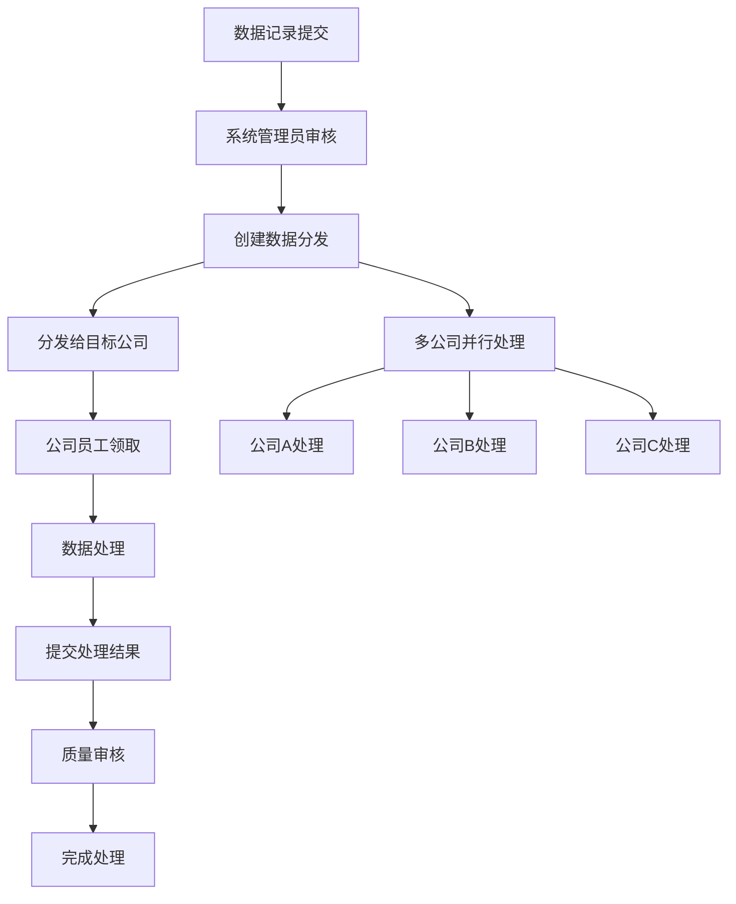

# 多公司数据处理系统需求文档

## 1. 产品概述

本系统是对现有数据收集系统的重要升级，旨在支持多个公司同时使用同一份数据进行处理。通过引入数据分发机制，实现数据资源的高效利用和多方协作处理。

系统解决的核心问题：将原有的单一处理模式升级为多公司协作处理模式，提高数据处理效率和资源利用率。

目标市场价值：为数据服务提供商提供多租户数据处理解决方案，支持业务规模化扩展。

## 2. 核心功能

### 2.1 用户角色

| 角色 | 注册方式 | 核心权限 |
|------|----------|----------|
| 系统管理员 | 系统初始化创建 | 管理所有公司、用户和数据，系统配置管理 |
| 公司管理员 | 系统管理员创建或邀请 | 管理本公司用户、查看公司数据统计、分发管理 |
| 普通员工 | 公司管理员邀请注册 | 领取和处理分发给本公司的数据记录 |

### 2.2 功能模块

我们的多公司数据处理系统包含以下主要页面：

1. **公司管理页面**：公司信息管理、公司状态控制、联系方式维护
2. **数据分发管理页面**：数据记录分发、分发状态跟踪、优先级管理
3. **多公司数据视图页面**：按公司维度查看数据、处理进度监控
4. **用户管理页面**：公司用户管理、角色权限分配
5. **统计报表页面**：公司维度统计、处理效率分析、数据质量报告
6. **系统配置页面**：分发规则配置、权限策略设置

### 2.3 页面详情

| 页面名称 | 模块名称 | 功能描述 |
|----------|----------|----------|
| 公司管理页面 | 公司列表 | 显示所有公司信息，支持搜索筛选、状态管理、批量操作 |
| 公司管理页面 | 公司详情 | 查看和编辑公司详细信息、联系方式、业务描述 |
| 公司管理页面 | 公司创建 | 创建新公司，设置基本信息、联系方式、初始配置 |
| 数据分发管理页面 | 分发列表 | 显示所有数据分发记录，支持状态筛选、公司筛选、时间筛选 |
| 数据分发管理页面 | 创建分发 | 选择数据记录和目标公司，设置优先级、截止时间、备注信息 |
| 数据分发管理页面 | 分发详情 | 查看分发详细信息、处理进度、结果数据、操作历史 |
| 多公司数据视图页面 | 数据概览 | 按公司维度展示数据处理概况，包括总量、进度、完成率 |
| 多公司数据视图页面 | 数据列表 | 显示数据记录列表，支持公司筛选、状态筛选、批量操作 |
| 用户管理页面 | 用户列表 | 管理公司用户，支持角色分配、状态管理、权限控制 |
| 用户管理页面 | 用户邀请 | 邀请新用户加入公司，设置初始角色和权限 |
| 统计报表页面 | 公司统计 | 各公司处理数据统计，包括数量、效率、质量指标 |
| 统计报表页面 | 趋势分析 | 数据处理趋势分析，支持时间维度、公司对比 |
| 系统配置页面 | 分发规则 | 配置自动分发规则、优先级策略、负载均衡设置 |

## 3. 核心流程

### 系统管理员流程
1. 创建和管理公司信息
2. 配置系统分发规则和权限策略
3. 监控整体系统运行状况和数据质量
4. 处理异常情况和系统维护

### 公司管理员流程
1. 管理公司用户，邀请新员工加入
2. 查看分发给公司的数据记录
3. 监控公司数据处理进度和质量
4. 分析公司处理效率和统计报表

### 普通员工流程
1. 登录系统查看分发给自己的数据任务
2. 领取待处理的数据记录
3. 完成数据处理并提交结果
4. 查看个人处理统计和历史记录

## 4. 用户界面设计

### 4.1 设计风格

- **主色调**：#1890ff（蓝色）作为主色，#52c41a（绿色）作为成功色
- **辅助色**：#faad14（橙色）作为警告色，#f5222d（红色）作为错误色
- **按钮样式**：圆角按钮设计，支持多种尺寸和状态
- **字体**：优先使用系统字体，中文使用微软雅黑，英文使用 Segoe UI
- **布局风格**：卡片式布局，顶部导航栏，左侧菜单栏
- **图标风格**：使用 Arco Design 图标库，简洁现代的线性图标

### 4.2 页面设计概览

| 页面名称 | 模块名称 | UI元素 |
|----------|----------|---------|
| 公司管理页面 | 公司列表 | 表格组件、搜索框、筛选器、操作按钮、分页器，支持卡片和列表两种视图模式 |
| 公司管理页面 | 公司表单 | 表单组件、输入框、选择器、文本域、提交按钮，采用两列布局 |
| 数据分发管理页面 | 分发列表 | 表格组件、状态标签、进度条、时间显示、操作菜单，支持批量操作 |
| 数据分发管理页面 | 分发创建 | 步骤条、数据选择器、公司选择器、优先级滑块、日期选择器 |
| 多公司数据视图页面 | 数据概览 | 统计卡片、图表组件、进度环、趋势图、公司对比表 |
| 统计报表页面 | 报表展示 | 图表库、数据表格、导出按钮、时间范围选择器、筛选面板 |

### 4.3 响应式设计

系统采用桌面优先的响应式设计，主要面向PC端用户使用。在移动端提供基本的查看功能，确保关键信息的可访问性。支持触摸操作优化，提供移动端友好的交互体验。

## 5. 技术特性

### 5.1 多租户架构
- 基于公司维度的数据隔离
- 灵活的权限控制机制
- 支持公司级别的配置定制

### 5.2 数据分发机制
- 智能分发算法，支持负载均衡
- 优先级队列管理
- 实时状态跟踪和通知

### 5.3 统计分析
- 多维度数据统计
- 实时处理进度监控
- 数据质量评估和报告

### 5.4 系统集成
- 保持与现有系统的兼容性
- 支持渐进式迁移
- 提供完整的API接口

## 6. 性能要求

### 6.1 响应时间
- 页面加载时间不超过3秒
- API接口响应时间不超过1秒
- 大数据量查询支持分页和缓存

### 6.2 并发处理
- 支持100+并发用户同时操作
- 数据分发处理支持队列机制
- 系统资源合理分配和监控

### 6.3 数据容量
- 支持百万级数据记录存储
- 支持千万级分发记录管理
- 提供数据归档和清理机制

## 7. 安全要求

### 7.1 数据安全
- 公司间数据严格隔离
- 敏感信息加密存储
- 完整的操作审计日志

### 7.2 访问控制
- 基于角色的权限管理
- 多级权限验证机制
- 会话安全和超时控制

### 7.3 系统安全
- API接口安全防护
- SQL注入和XSS防护
- 定期安全漏洞扫描

## 8. 部署要求

### 8.1 环境要求
- PHP 8.1+ 运行环境
- MySQL 8.0+ 数据库
- Node.js 18+ 前端构建环境

### 8.2 服务器配置
- 推荐4核8GB内存配置
- SSD存储提升性能
- 负载均衡和高可用部署

### 8.3 监控运维
- 系统性能监控
- 错误日志收集
- 自动化备份机制