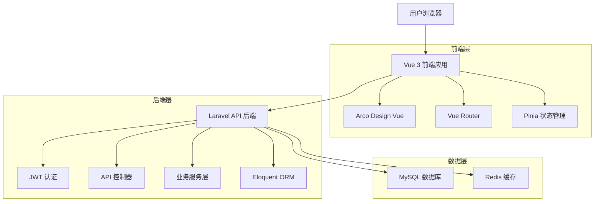
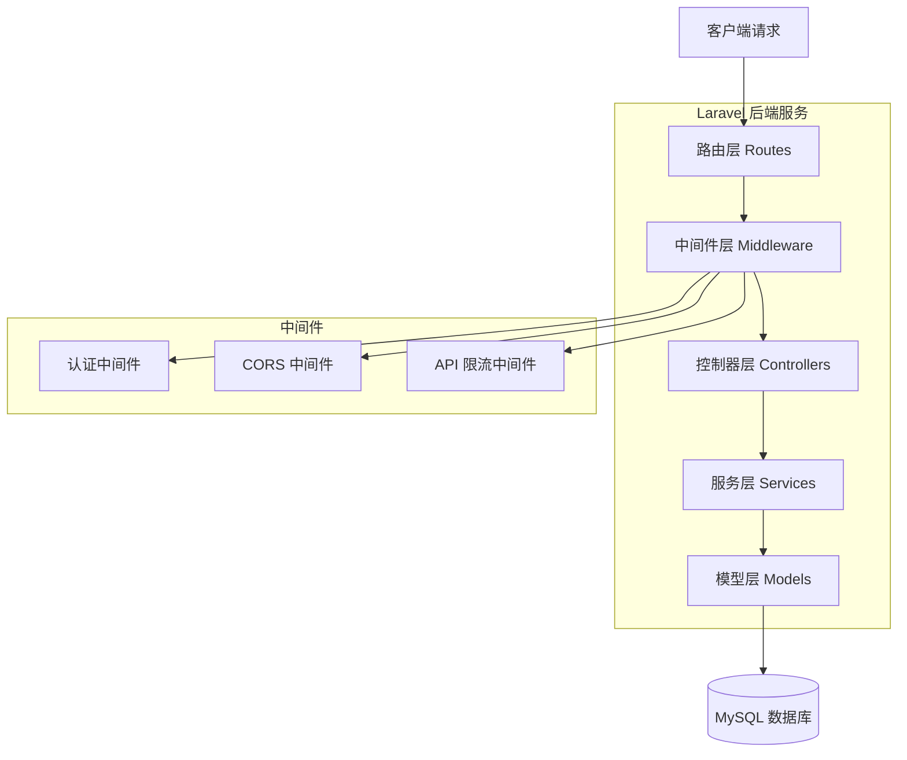
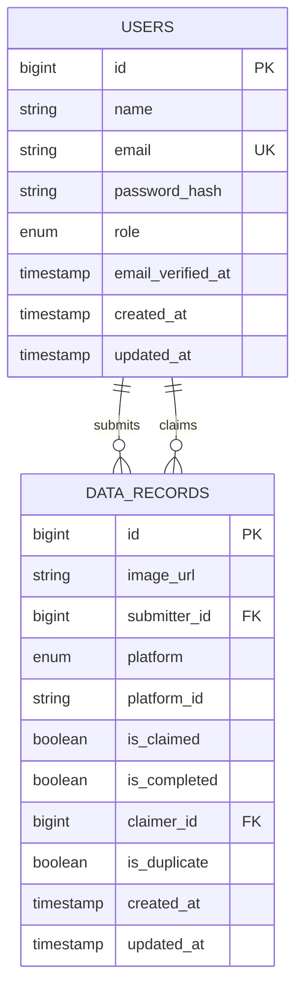

# 数据采集平台技术架构文档

## 1. 架构设计



## 2. 技术描述

- **前端**：Vue 3 + TypeScript + Arco Design Vue + Vite + Pinia
- **后端**：Laravel 10 + PHP 8.1+ + JWT Auth
- **数据库**：MySQL 8.0 + Redis 6.0
- **开发工具**：Composer + NPM + Laravel Artisan

## 3. 路由定义

| 路由 | 用途 |
|------|-----|
| /login | 登录页面，用户身份验证 |
| /register | 注册页面，新用户注册 |
| /dashboard | 仪表板页面，数据概览和快速操作 |
| /data-management | 数据管理页面，数据列表和操作 |
| /data-submit | 数据提交页面，新数据录入 |
| /profile | 个人中心页面，用户信息和历史记录 |
| /admin/users | 用户管理页面，管理员专用 |
| /admin/statistics | 数据统计页面，管理员专用 |

## 4. API 定义

### 4.1 核心 API

**用户认证相关**
```
POST /api/auth/login
```

请求参数：
| 参数名 | 参数类型 | 是否必需 | 描述 |
|--------|----------|----------|------|
| email | string | true | 用户邮箱 |
| password | string | true | 用户密码 |

响应参数：
| 参数名 | 参数类型 | 描述 |
|--------|----------|------|
| success | boolean | 请求是否成功 |
| data | object | 用户信息和token |
| message | string | 响应消息 |

示例：
```json
{
  "success": true,
  "data": {
    "user": {
      "id": 1,
      "name": "张三",
      "email": "zhangsan@example.com",
      "role": "user"
    },
    "token": "eyJ0eXAiOiJKV1QiLCJhbGciOiJIUzI1NiJ9..."
  },
  "message": "登录成功"
}
```

**数据管理相关**
```
GET /api/data
```

请求参数：
| 参数名 | 参数类型 | 是否必需 | 描述 |
|--------|----------|----------|------|
| platform | string | false | 平台筛选（douyin, xiaohongshu, taobao, xianyu） |
| status | string | false | 状态筛选（pending, claimed, completed） |
| page | integer | false | 页码 |
| per_page | integer | false | 每页数量 |

```
POST /api/data
```

请求参数：
| 参数名 | 参数类型 | 是否必需 | 描述 |
|--------|----------|----------|------|
| image_url | string | true | 图片URL |
| platform | string | true | 来源平台 |
| platform_id | string | true | 平台ID |

```
PUT /api/data/{id}/claim
```

响应参数：
| 参数名 | 参数类型 | 描述 |
|--------|----------|------|
| success | boolean | 操作是否成功 |
| data | object | 更新后的数据 |
| message | string | 操作结果消息 |

## 5. 服务器架构图



## 6. 数据模型

### 6.1 数据模型定义



### 6.2 数据定义语言

**用户表 (users)**
```sql
-- 创建用户表
CREATE TABLE users (
    id BIGINT UNSIGNED AUTO_INCREMENT PRIMARY KEY,
    name VARCHAR(255) NOT NULL COMMENT '用户姓名',
    email VARCHAR(255) UNIQUE NOT NULL COMMENT '用户邮箱',
    email_verified_at TIMESTAMP NULL COMMENT '邮箱验证时间',
    password VARCHAR(255) NOT NULL COMMENT '密码哈希',
    role ENUM('admin', 'user') DEFAULT 'user' COMMENT '用户角色',
    created_at TIMESTAMP DEFAULT CURRENT_TIMESTAMP COMMENT '创建时间',
    updated_at TIMESTAMP DEFAULT CURRENT_TIMESTAMP ON UPDATE CURRENT_TIMESTAMP COMMENT '更新时间'
) ENGINE=InnoDB DEFAULT CHARSET=utf8mb4 COLLATE=utf8mb4_unicode_ci COMMENT='用户表';

-- 创建索引
CREATE INDEX idx_users_email ON users(email);
CREATE INDEX idx_users_role ON users(role);

-- 初始化管理员数据
INSERT INTO users (name, email, password, role) VALUES 
('系统管理员', 'admin@datacollection.com', '$2y$10$92IXUNpkjO0rOQ5byMi.Ye4oKoEa3Ro9llC/.og/at2.uheWG/igi', 'admin');
```

**数据记录表 (data_records)**
```sql
-- 创建数据记录表
CREATE TABLE data_records (
    id BIGINT UNSIGNED AUTO_INCREMENT PRIMARY KEY,
    image_url TEXT NOT NULL COMMENT '图片URL',
    submitter_id BIGINT UNSIGNED NOT NULL COMMENT '提交人ID',
    platform ENUM('douyin', 'xiaohongshu', 'taobao', 'xianyu') NOT NULL COMMENT '来源平台',
    platform_id VARCHAR(255) NOT NULL COMMENT '平台ID',
    is_claimed BOOLEAN DEFAULT FALSE COMMENT '是否被领取',
    is_completed BOOLEAN DEFAULT FALSE COMMENT '是否添加成功',
    claimer_id BIGINT UNSIGNED NULL COMMENT '领取人用户ID',
    is_duplicate BOOLEAN DEFAULT FALSE COMMENT '是否重复',
    created_at TIMESTAMP DEFAULT CURRENT_TIMESTAMP COMMENT '创建时间',
    updated_at TIMESTAMP DEFAULT CURRENT_TIMESTAMP ON UPDATE CURRENT_TIMESTAMP COMMENT '更新时间',
    
    INDEX idx_data_records_submitter_id (submitter_id),
    INDEX idx_data_records_claimer_id (claimer_id),
    INDEX idx_data_records_platform (platform),
    INDEX idx_data_records_status (is_claimed, is_completed),
    INDEX idx_data_records_created_at (created_at DESC),
    UNIQUE KEY uk_platform_id (platform, platform_id)
) ENGINE=InnoDB DEFAULT CHARSET=utf8mb4 COLLATE=utf8mb4_unicode_ci COMMENT='数据记录表';
```

**API 统一响应格式**
```php
// 成功响应格式
{
    "success": true,
    "data": {}, // 具体数据
    "message": "操作成功",
    "code": 200
}

// 错误响应格式
{
    "success": false,
    "data": null,
    "message": "错误信息",
    "code": 400,
    "errors": {} // 详细错误信息（可选）
}
```