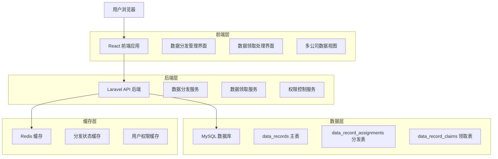
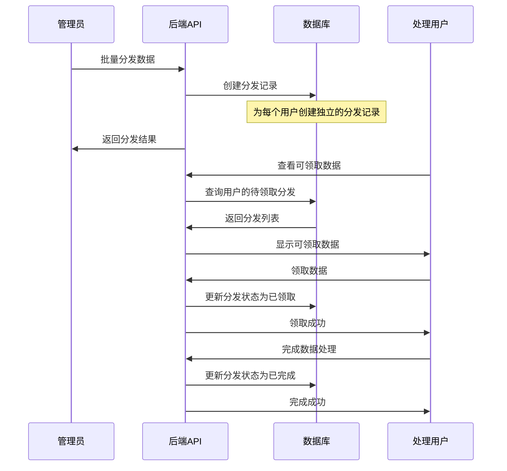

# 数据分发系统改进技术架构文档

## 1. 架构设计



## 2. 技术描述

- 前端：Vue 3 + Arco Design Vue + TypeScript + Vite
- 后端：Laravel 10 + PHP 8.1
- 数据库：MySQL 8.0
- 缓存：Redis 7.0
- 队列：Laravel Queue (Redis 驱动)

## 3. 核心问题分析

### 3.1 当前系统限制

1. **唯一约束问题**：`data_record_assignments` 表的 `unique(['data_record_id', 'company_id'])` 约束阻止同一数据记录分发给同一公司的多个处理人
2. **单一处理人限制**：`assigned_to` 字段只能指定一个处理人，无法支持多人并行处理
3. **业务逻辑不一致**：分发表的处理逻辑与主表的领取逻辑不统一

### 3.2 目标需求

1. 同一条数据记录可以分发给多个公司
2. 每个公司下的多个账户都可以领取并操作同一条数据
3. 领取和通过逻辑要和主表 `data_records` 保持一致
4. 支持多个处理人同时处理同一条数据记录

## 4. 数据库设计方案

### 4.1 方案一：修改现有表结构（推荐）

#### 4.1.1 修改 data_record_assignments 表

```sql
-- 移除唯一约束，允许同一数据记录分发给同一公司的多个处理人
ALTER TABLE data_record_assignments DROP INDEX data_record_assignments_data_record_id_company_id_unique;

-- 添加新的复合唯一约束，确保同一数据记录不会重复分发给同一个具体用户
ALTER TABLE data_record_assignments ADD UNIQUE KEY unique_assignment (data_record_id, company_id, assigned_to);

-- 修改 assigned_to 字段为必填，每个分发记录必须指定具体处理人
ALTER TABLE data_record_assignments MODIFY COLUMN assigned_to BIGINT UNSIGNED NOT NULL COMMENT '处理人ID';

-- 添加领取相关字段，与主表逻辑保持一致
ALTER TABLE data_record_assignments 
ADD COLUMN is_claimed BOOLEAN DEFAULT FALSE COMMENT '是否已领取',
ADD COLUMN claimed_at TIMESTAMP NULL COMMENT '领取时间',
ADD COLUMN is_completed BOOLEAN DEFAULT FALSE COMMENT '是否已完成',
ADD COLUMN completed_at TIMESTAMP NULL COMMENT '完成时间';

-- 添加索引优化查询性能
CREATE INDEX idx_assignments_claim_status ON data_record_assignments(company_id, assigned_to, is_claimed, is_completed);
CREATE INDEX idx_assignments_data_record ON data_record_assignments(data_record_id, status);
```

#### 4.1.2 数据模型定义

```sql
-- 更新后的 data_record_assignments 表结构
CREATE TABLE data_record_assignments (
    id BIGINT UNSIGNED AUTO_INCREMENT PRIMARY KEY,
    data_record_id BIGINT UNSIGNED NOT NULL COMMENT '数据记录ID',
    company_id BIGINT UNSIGNED NOT NULL COMMENT '公司ID',
    assigned_by BIGINT UNSIGNED NOT NULL COMMENT '分发人ID',
    assigned_to BIGINT UNSIGNED NOT NULL COMMENT '处理人ID',
    status ENUM('pending', 'claimed', 'in_progress', 'completed', 'rejected') DEFAULT 'pending' COMMENT '处理状态',
    is_claimed BOOLEAN DEFAULT FALSE COMMENT '是否已领取',
    claimed_at TIMESTAMP NULL COMMENT '领取时间',
    is_completed BOOLEAN DEFAULT FALSE COMMENT '是否已完成',
    completed_at TIMESTAMP NULL COMMENT '完成时间',
    notes TEXT NULL COMMENT '备注信息',
    assigned_at TIMESTAMP DEFAULT CURRENT_TIMESTAMP COMMENT '分发时间',
    started_at TIMESTAMP NULL COMMENT '开始处理时间',
    created_at TIMESTAMP DEFAULT CURRENT_TIMESTAMP,
    updated_at TIMESTAMP DEFAULT CURRENT_TIMESTAMP ON UPDATE CURRENT_TIMESTAMP,
    
    -- 索引
    INDEX idx_data_record_company (data_record_id, company_id),
    INDEX idx_company_status (company_id, status),
    INDEX idx_assigned_to_status (assigned_to, status),
    INDEX idx_claim_status (company_id, assigned_to, is_claimed, is_completed),
    INDEX idx_status (status),
    
    -- 唯一约束：同一数据记录不能重复分发给同一个具体用户
    UNIQUE KEY unique_assignment (data_record_id, company_id, assigned_to),
    
    -- 外键约束
    FOREIGN KEY (data_record_id) REFERENCES data_records(id) ON DELETE CASCADE,
    FOREIGN KEY (company_id) REFERENCES companies(id) ON DELETE CASCADE,
    FOREIGN KEY (assigned_by) REFERENCES users(id),
    FOREIGN KEY (assigned_to) REFERENCES users(id)
);
```

### 4.2 方案二：新增独立领取表（备选）

如果需要更清晰的业务分离，可以新增一个独立的领取表：

```sql
-- 创建数据记录领取表
CREATE TABLE data_record_claims (
    id BIGINT UNSIGNED AUTO_INCREMENT PRIMARY KEY,
    assignment_id BIGINT UNSIGNED NOT NULL COMMENT '分发记录ID',
    data_record_id BIGINT UNSIGNED NOT NULL COMMENT '数据记录ID',
    company_id BIGINT UNSIGNED NOT NULL COMMENT '公司ID',
    claimer_id BIGINT UNSIGNED NOT NULL COMMENT '领取人ID',
    status ENUM('claimed', 'in_progress', 'completed', 'rejected') DEFAULT 'claimed' COMMENT '处理状态',
    claimed_at TIMESTAMP DEFAULT CURRENT_TIMESTAMP COMMENT '领取时间',
    started_at TIMESTAMP NULL COMMENT '开始处理时间',
    completed_at TIMESTAMP NULL COMMENT '完成时间',
    notes TEXT NULL COMMENT '处理备注',
    created_at TIMESTAMP DEFAULT CURRENT_TIMESTAMP,
    updated_at TIMESTAMP DEFAULT CURRENT_TIMESTAMP ON UPDATE CURRENT_TIMESTAMP,
    
    -- 索引
    INDEX idx_assignment (assignment_id),
    INDEX idx_data_record (data_record_id),
    INDEX idx_claimer_status (claimer_id, status),
    INDEX idx_company_status (company_id, status),
    
    -- 唯一约束：同一分发记录只能被同一用户领取一次
    UNIQUE KEY unique_claim (assignment_id, claimer_id),
    
    -- 外键约束
    FOREIGN KEY (assignment_id) REFERENCES data_record_assignments(id) ON DELETE CASCADE,
    FOREIGN KEY (data_record_id) REFERENCES data_records(id) ON DELETE CASCADE,
    FOREIGN KEY (company_id) REFERENCES companies(id) ON DELETE CASCADE,
    FOREIGN KEY (claimer_id) REFERENCES users(id)
);
```

## 5. API 接口设计

### 5.1 数据分发相关接口

#### 5.1.1 批量分发数据到多个用户

```
POST /api/data-assignments/batch-assign-users
```

请求参数：
| 参数名 | 类型 | 必填 | 描述 |
|--------|------|------|------|
| data_record_ids | array | 是 | 数据记录ID数组 |
| assignments | array | 是 | 分发配置数组 |
| assignments.*.company_id | integer | 是 | 公司ID |
| assignments.*.user_ids | array | 是 | 用户ID数组 |
| notes | string | 否 | 分发备注 |

响应示例：
```json
{
  "success": true,
  "message": "批量分发成功",
  "data": {
    "total_assignments": 15,
    "successful_assignments": 14,
    "failed_assignments": 1,
    "details": [
      {
        "data_record_id": 1,
        "company_id": 1,
        "assigned_to": 5,
        "status": "success"
      }
    ]
  }
}
```

#### 5.1.2 获取用户可领取的分发数据

```
GET /api/data-assignments/my-available
```

查询参数：
| 参数名 | 类型 | 必填 | 描述 |
|--------|------|------|------|
| page | integer | 否 | 页码 |
| per_page | integer | 否 | 每页数量 |
| status | string | 否 | 状态筛选 |
| platform | string | 否 | 平台筛选 |

#### 5.1.3 领取分发的数据

```
POST /api/data-assignments/{id}/claim
```

响应示例：
```json
{
  "success": true,
  "message": "领取成功",
  "data": {
    "assignment_id": 123,
    "data_record_id": 456,
    "claimed_at": "2025-01-15T10:30:00Z",
    "status": "claimed"
  }
}
```

### 5.2 数据统计接口

#### 5.2.1 获取分发统计数据

```
GET /api/statistics/assignments
```

响应示例：
```json
{
  "success": true,
  "data": {
    "total_assignments": 1000,
    "pending_assignments": 150,
    "claimed_assignments": 300,
    "completed_assignments": 500,
    "by_company": [
      {
        "company_id": 1,
        "company_name": "公司A",
        "total": 200,
        "completed": 150
      }
    ]
  }
}
```

## 6. 业务逻辑设计

### 6.1 数据分发流程



### 6.2 核心服务类设计

#### 6.2.1 DataAssignmentService 改进

```php
<?php

namespace App\Services;

class DataAssignmentService
{
    /**
     * 批量分发数据到多个用户
     */
    public function batchAssignToUsers(
        array $dataRecordIds, 
        array $assignments, 
        User $assignedBy, 
        ?string $notes = null
    ): array {
        $results = [];
        
        DB::transaction(function () use ($dataRecordIds, $assignments, $assignedBy, $notes, &$results) {
            foreach ($dataRecordIds as $dataRecordId) {
                foreach ($assignments as $assignment) {
                    $companyId = $assignment['company_id'];
                    $userIds = $assignment['user_ids'];
                    
                    foreach ($userIds as $userId) {
                        // 检查是否已经分发给该用户
                        $existing = DataRecordAssignment::where([
                            'data_record_id' => $dataRecordId,
                            'company_id' => $companyId,
                            'assigned_to' => $userId
                        ])->first();
                        
                        if ($existing) {
                            $results[] = [
                                'data_record_id' => $dataRecordId,
                                'company_id' => $companyId,
                                'assigned_to' => $userId,
                                'status' => 'skipped',
                                'reason' => '已存在分发记录'
                            ];
                            continue;
                        }
                        
                        // 创建新的分发记录
                        $newAssignment = DataRecordAssignment::create([
                            'data_record_id' => $dataRecordId,
                            'company_id' => $companyId,
                            'assigned_by' => $assignedBy->id,
                            'assigned_to' => $userId,
                            'status' => 'pending',
                            'notes' => $notes,
                            'assigned_at' => now(),
                        ]);
                        
                        $results[] = [
                            'data_record_id' => $dataRecordId,
                            'company_id' => $companyId,
                            'assigned_to' => $userId,
                            'assignment_id' => $newAssignment->id,
                            'status' => 'success'
                        ];
                    }
                }
            }
        });
        
        return $results;
    }
    
    /**
     * 用户领取分发的数据
     */
    public function claimAssignment(DataRecordAssignment $assignment, User $user): bool
    {
        // 验证用户权限
        if ($assignment->assigned_to !== $user->id) {
            throw new \Exception('无权限领取此数据');
        }
        
        // 检查状态
        if ($assignment->status !== 'pending') {
            throw new \Exception('数据已被处理或不可领取');
        }
        
        // 更新状态
        $assignment->update([
            'status' => 'claimed',
            'is_claimed' => true,
            'claimed_at' => now(),
        ]);
        
        return true;
    }
    
    /**
     * 完成数据处理
     */
    public function completeAssignment(DataRecordAssignment $assignment, User $user): bool
    {
        // 验证用户权限
        if ($assignment->assigned_to !== $user->id) {
            throw new \Exception('无权限完成此数据');
        }
        
        // 检查状态
        if (!in_array($assignment->status, ['claimed', 'in_progress'])) {
            throw new \Exception('数据状态不允许完成操作');
        }
        
        // 更新状态
        $assignment->update([
            'status' => 'completed',
            'is_completed' => true,
            'completed_at' => now(),
        ]);
        
        return true;
    }
}
```

## 7. 前端界面设计

### 7.1 数据分发管理界面改进

#### 7.1.1 批量分发到多用户组件

```vue
<template>
  <a-modal
    v-model:visible="visible"
    title="批量分发数据"
    width="800px"
    @ok="handleSubmit"
  >
    <a-form :model="form" layout="vertical">
      <!-- 选择数据记录 -->
      <a-form-item label="选择数据记录">
        <a-select
          v-model="form.data_record_ids"
          multiple
          placeholder="选择要分发的数据记录"
          :loading="recordsLoading"
        >
          <a-option
            v-for="record in availableRecords"
            :key="record.id"
            :value="record.id"
          >
            {{ record.title || `记录 #${record.id}` }}
          </a-option>
        </a-select>
      </a-form-item>
      
      <!-- 分发配置 -->
      <a-form-item label="分发配置">
        <div v-for="(assignment, index) in form.assignments" :key="index" class="assignment-item">
          <a-row :gutter="16">
            <a-col :span="8">
              <a-select
                v-model="assignment.company_id"
                placeholder="选择公司"
                @change="loadCompanyUsers(assignment.company_id, index)"
              >
                <a-option
                  v-for="company in companies"
                  :key="company.id"
                  :value="company.id"
                >
                  {{ company.name }}
                </a-option>
              </a-select>
            </a-col>
            <a-col :span="14">
              <a-select
                v-model="assignment.user_ids"
                multiple
                placeholder="选择处理用户"
                :loading="assignment.usersLoading"
              >
                <a-option
                  v-for="user in assignment.users"
                  :key="user.id"
                  :value="user.id"
                >
                  {{ user.name }} ({{ user.account }})
                </a-option>
              </a-select>
            </a-col>
            <a-col :span="2">
              <a-button
                type="text"
                danger
                @click="removeAssignment(index)"
              >
                删除
              </a-button>
            </a-col>
          </a-row>
        </div>
        
        <a-button type="dashed" @click="addAssignment" class="add-assignment-btn">
          + 添加分发配置
        </a-button>
      </a-form-item>
      
      <!-- 备注 -->
      <a-form-item label="分发备注">
        <a-textarea
          v-model="form.notes"
          placeholder="输入分发备注（可选）"
          :max-length="500"
          show-word-limit
        />
      </a-form-item>
    </a-form>
  </a-modal>
</template>

<script setup lang="ts">
import { reactive, ref } from 'vue'
import { batchAssignToUsers, getAvailableRecords } from '@/api/dataAssignment'
import { getActiveCompanies } from '@/api/company'
import { getUsersByCompany } from '@/api/user'

interface AssignmentConfig {
  company_id?: number
  user_ids: number[]
  users: User[]
  usersLoading: boolean
}

const form = reactive({
  data_record_ids: [] as number[],
  assignments: [] as AssignmentConfig[],
  notes: ''
})

const addAssignment = () => {
  form.assignments.push({
    company_id: undefined,
    user_ids: [],
    users: [],
    usersLoading: false
  })
}

const loadCompanyUsers = async (companyId: number, index: number) => {
  const assignment = form.assignments[index]
  assignment.usersLoading = true
  
  try {
    const response = await getUsersByCompany(companyId)
    assignment.users = response.data
  } catch (error) {
    console.error('加载公司用户失败:', error)
  } finally {
    assignment.usersLoading = false
  }
}

const handleSubmit = async () => {
  try {
    await batchAssignToUsers({
      data_record_ids: form.data_record_ids,
      assignments: form.assignments.map(a => ({
        company_id: a.company_id!,
        user_ids: a.user_ids
      })),
      notes: form.notes
    })
    
    // 成功处理
    visible.value = false
    emit('success')
  } catch (error) {
    console.error('分发失败:', error)
  }
}
</script>
```

### 7.2 用户数据领取界面

#### 7.2.1 我的待领取数据列表

```vue
<template>
  <a-card title="我的待领取数据">
    <a-table
      :columns="columns"
      :data="tableData"
      :loading="loading"
      :pagination="pagination"
      @page-change="handlePageChange"
    >
      <template #status="{ record }">
        <a-tag :color="getStatusColor(record.status)">
          {{ getStatusText(record.status) }}
        </a-tag>
      </template>
      
      <template #actions="{ record }">
        <a-space>
          <a-button
            v-if="record.status === 'pending'"
            type="primary"
            size="small"
            @click="claimData(record)"
            :loading="claimingIds.has(record.id)"
          >
            领取
          </a-button>
          
          <a-button
            v-if="record.status === 'claimed'"
            type="primary"
            size="small"
            @click="completeData(record)"
            :loading="completingIds.has(record.id)"
          >
            完成
          </a-button>
          
          <a-button
            size="small"
            @click="viewDetail(record)"
          >
            查看详情
          </a-button>
        </a-space>
      </template>
    </a-table>
  </a-card>
</template>

<script setup lang="ts">
import { ref, reactive, onMounted } from 'vue'
import { getMyAvailableAssignments, claimAssignment, completeAssignment } from '@/api/dataAssignment'

const columns = [
  { title: '数据记录', dataIndex: 'data_record.title', key: 'title' },
  { title: '平台', dataIndex: 'data_record.platform', key: 'platform' },
  { title: '分发时间', dataIndex: 'assigned_at', key: 'assigned_at' },
  { title: '状态', slotName: 'status', key: 'status' },
  { title: '操作', slotName: 'actions', key: 'actions' }
]

const tableData = ref([])
const loading = ref(false)
const claimingIds = ref(new Set())
const completingIds = ref(new Set())

const claimData = async (record: any) => {
  claimingIds.value.add(record.id)
  
  try {
    await claimAssignment(record.id)
    await loadData() // 重新加载数据
  } catch (error) {
    console.error('领取失败:', error)
  } finally {
    claimingIds.value.delete(record.id)
  }
}

const completeData = async (record: any) => {
  completingIds.value.add(record.id)
  
  try {
    await completeAssignment(record.id)
    await loadData() // 重新加载数据
  } catch (error) {
    console.error('完成失败:', error)
  } finally {
    completingIds.value.delete(record.id)
  }
}
</script>
```

## 8. 数据迁移策略

### 8.1 迁移步骤

#### 8.1.1 第一阶段：表结构修改

```sql
-- 1. 备份现有数据
CREATE TABLE data_record_assignments_backup AS SELECT * FROM data_record_assignments;

-- 2. 移除唯一约束
ALTER TABLE data_record_assignments DROP INDEX data_record_assignments_data_record_id_company_id_unique;

-- 3. 修改字段
ALTER TABLE data_record_assignments 
MODIFY COLUMN assigned_to BIGINT UNSIGNED NOT NULL COMMENT '处理人ID',
ADD COLUMN is_claimed BOOLEAN DEFAULT FALSE COMMENT '是否已领取',
ADD COLUMN claimed_at TIMESTAMP NULL COMMENT '领取时间',
ADD COLUMN is_completed BOOLEAN DEFAULT FALSE COMMENT '是否已完成',
ADD COLUMN completed_at TIMESTAMP NULL COMMENT '完成时间';

-- 4. 添加新的唯一约束
ALTER TABLE data_record_assignments ADD UNIQUE KEY unique_assignment (data_record_id, company_id, assigned_to);

-- 5. 添加索引
CREATE INDEX idx_assignments_claim_status ON data_record_assignments(company_id, assigned_to, is_claimed, is_completed);
```

#### 8.1.2 第二阶段：数据迁移

```php
<?php

use Illuminate\Database\Migrations\Migration;
use Illuminate\Support\Facades\DB;

return new class extends Migration
{
    public function up(): void
    {
        // 迁移现有数据的状态
        DB::statement("
            UPDATE data_record_assignments 
            SET 
                is_claimed = CASE 
                    WHEN status IN ('in_progress', 'completed') THEN TRUE 
                    ELSE FALSE 
                END,
                claimed_at = CASE 
                    WHEN status IN ('in_progress', 'completed') THEN started_at 
                    ELSE NULL 
                END,
                is_completed = CASE 
                    WHEN status = 'completed' THEN TRUE 
                    ELSE FALSE 
                END,
                completed_at = CASE 
                    WHEN status = 'completed' THEN completed_at 
                    ELSE NULL 
                END
        ");
        
        // 处理 assigned_to 为 NULL 的记录
        // 可以选择删除或者分配给默认用户
        DB::statement("DELETE FROM data_record_assignments WHERE assigned_to IS NULL");
    }
};
```

### 8.2 回滚策略

```sql
-- 如果需要回滚，可以使用备份数据
DROP TABLE data_record_assignments;
RENAME TABLE data_record_assignments_backup TO data_record_assignments;
```

## 9. 性能优化建议

### 9.1 数据库优化

1. **索引优化**：为常用查询条件添加复合索引
2. **分区策略**：按时间对大表进行分区
3. **读写分离**：使用主从复制分离读写操作

### 9.2 缓存策略

1. **Redis 缓存**：缓存用户权限和公司信息
2. **查询缓存**：缓存频繁查询的统计数据
3. **页面缓存**：缓存静态页面内容

### 9.3 队列处理

1. **异步分发**：大批量分发操作使用队列异步处理
2. **通知队列**：用户状态变更通知使用队列发送

## 10. 监控和日志

### 10.1 业务监控

1. **分发成功率**：监控数据分发的成功率
2. **处理效率**：监控用户处理数据的效率
3. **系统负载**：监控数据库和服务器负载

### 10.2 日志记录

1. **操作日志**：记录所有分发和领取操作
2. **错误日志**：记录系统错误和异常
3. **性能日志**：记录慢查询和性能问题

## 11. 安全考虑

### 11.1 权限控制

1. **角色权限**：严格控制不同角色的操作权限
2. **数据隔离**：确保公司间数据隔离
3. **操作审计**：记录所有敏感操作的审计日志

### 11.2 数据安全

1. **数据加密**：敏感数据进行加密存储
2. **访问控制**：限制数据访问权限
3. **备份策略**：定期备份重要数据

---

*本技术架构文档提供了完整的数据分发系统改进方案，确保系统能够支持多公司、多用户的并行数据处理需求。*