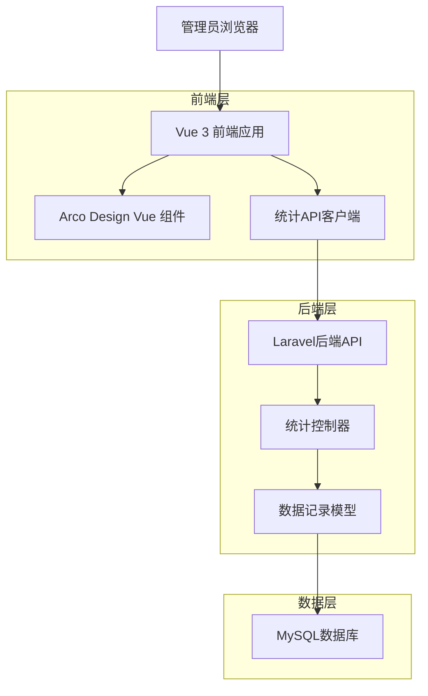
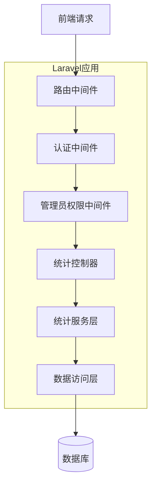
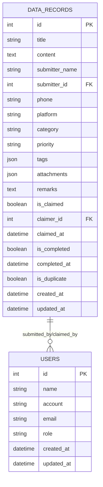

# 数据统计功能技术架构文档

## 1. 架构设计



## 2. 技术描述

- **前端**：Vue 3 + TypeScript + Arco Design Vue + Vite + ECharts
- **后端**：Laravel 10 + PHP 8.1 + Sanctum认证
- **数据库**：MySQL 8.0
- **图表库**：ECharts 5.x（用于数据可视化）

## 3. 路由定义

| 路由 | 用途 |
|------|------|
| /admin/claim-statistics | 领取统计页面，显示数据领取和通过情况 |
| /admin/collection-statistics | 收集统计页面，显示数据收集和质量情况 |

## 4. API定义

### 4.1 领取统计API

**获取领取统计数据**
```
GET /api/statistics/claims
```

请求参数：
| 参数名 | 参数类型 | 是否必需 | 描述 |
|--------|----------|----------|------|
| date | string | false | 查询日期，格式：YYYY-MM-DD，默认当天 |
| start_date | string | false | 开始日期，格式：YYYY-MM-DD |
| end_date | string | false | 结束日期，格式：YYYY-MM-DD |

响应数据：
| 参数名 | 参数类型 | 描述 |
|--------|----------|------|
| total_records | integer | 总数据量 |
| claimed_records | integer | 已领取数据量 |
| completed_records | integer | 已通过数据量 |
| completion_rate | float | 通过率（百分比） |
| user_statistics | array | 用户统计列表 |

示例响应：
```json
{
  "success": true,
  "data": {
    "total_records": 1000,
    "claimed_records": 800,
    "completed_records": 600,
    "completion_rate": 75.0,
    "user_statistics": [
      {
        "user_id": 1,
        "user_name": "张三",
        "claimed_count": 50,
        "completed_count": 40,
        "completion_rate": 80.0
      }
    ]
  }
}
```

### 4.2 收集统计API

**获取收集统计数据**
```
GET /api/statistics/collections
```

请求参数：
| 参数名 | 参数类型 | 是否必需 | 描述 |
|--------|----------|----------|------|
| date | string | false | 查询日期，格式：YYYY-MM-DD，默认当天 |
| start_date | string | false | 开始日期，格式：YYYY-MM-DD |
| end_date | string | false | 结束日期，格式：YYYY-MM-DD |

响应数据：
| 参数名 | 参数类型 | 描述 |
|--------|----------|------|
| total_records | integer | 总数据量 |
| claimed_records | integer | 已领取数据量 |
| completed_records | integer | 已通过数据量 |
| completion_rate | float | 通过率（百分比） |
| duplicate_records | integer | 重复数据量 |
| duplicate_rate | float | 重复率（百分比） |
| user_statistics | array | 用户统计列表 |

示例响应：
```json
{
  "success": true,
  "data": {
    "total_records": 1000,
    "claimed_records": 800,
    "completed_records": 600,
    "completion_rate": 75.0,
    "duplicate_records": 50,
    "duplicate_rate": 5.0,
    "user_statistics": [
      {
        "user_id": 1,
        "user_name": "张三",
        "submitted_count": 100,
        "duplicate_count": 5,
        "duplicate_rate": 5.0
      }
    ]
  }
}
```

## 5. 服务器架构图



## 6. 数据模型

### 6.1 数据模型定义

统计功能主要基于现有的数据记录表，不需要新增表结构：



### 6.2 统计查询逻辑

**领取统计查询**：
- 总数据：按日期筛选的所有数据记录
- 已领取数据：is_claimed = true 的记录
- 已通过数据：is_completed = true 的记录
- 通过率：已通过数据 / 已领取数据 * 100%
- 用户统计：按 claimer_id 分组统计

**收集统计查询**：
- 总数据：按日期筛选的所有数据记录
- 已领取数据：is_claimed = true 的记录
- 已通过数据：is_completed = true 的记录
- 通过率：已通过数据 / 总数据 * 100%
- 重复数据：is_duplicate = true 的记录
- 重复率：重复数据 / 总数据 * 100%
- 用户统计：按 submitter_id 分组统计