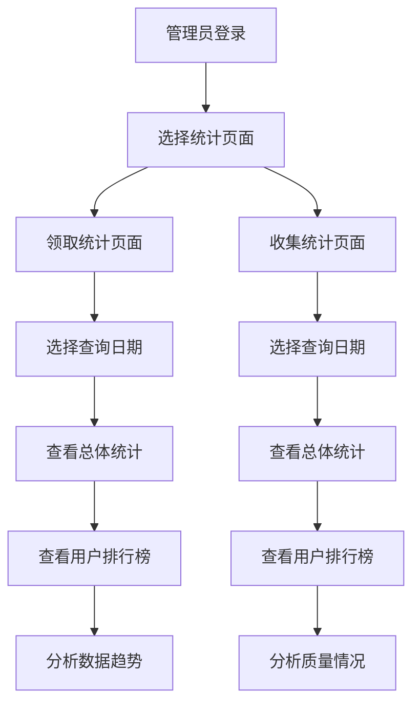

# 数据统计功能需求文档

## 1. 产品概述

数据统计功能是数据采集平台的重要管理模块，为管理员提供全面的数据分析和统计报表功能。该功能帮助管理员实时监控数据采集进度、用户工作效率和数据质量，为平台运营决策提供数据支撑。

## 2. 核心功能

### 2.1 用户角色

| 角色 | 访问权限 | 核心权限 |
|------|----------|----------|
| 管理员 | 完整访问权限 | 可查看所有统计数据、筛选日期、导出报表 |
| 普通用户 | 无访问权限 | 无法访问统计页面 |

### 2.2 功能模块

数据统计功能包含以下主要页面：
1. **领取统计页面**：数据领取情况分析，用户工作效率统计
2. **收集统计页面**：数据收集质量分析，重复数据监控

### 2.3 页面详情

| 页面名称 | 模块名称 | 功能描述 |
|----------|----------|----------|
| 领取统计页面 | 日期筛选器 | 选择查询日期范围，默认当天，支持日历选择 |
| 领取统计页面 | 总体统计卡片 | 显示总数据量、已领取数据、已通过数据、通过率等关键指标 |
| 领取统计页面 | 用户领取排行榜 | 按用户统计领取数量和通过数量，支持排序 |
| 领取统计页面 | 数据趋势图表 | 显示领取和通过数据的时间趋势 |
| 收集统计页面 | 日期筛选器 | 选择查询日期范围，默认当天，支持日历选择 |
| 收集统计页面 | 总体统计卡片 | 显示总数据量、已领取数据、已通过数据、通过率、重复数据、重复率 |
| 收集统计页面 | 用户提交排行榜 | 按用户统计提交数量和重复数量，计算重复率 |
| 收集统计页面 | 质量分析图表 | 显示数据质量趋势和重复数据分布 |

## 3. 核心流程

### 管理员操作流程

1. 管理员登录系统后，在侧边栏菜单中选择"数据统计"
2. 进入统计页面，默认显示当天数据
3. 可通过日期选择器筛选特定日期的数据
4. 查看总体统计指标和详细的用户排行榜
5. 分析数据趋势和质量情况

## 4. 用户界面设计

### 4.1 设计风格

- **主色调**：#1890ff（蓝色）、#52c41a（绿色）
- **辅助色**：#faad14（橙色）、#f5222d（红色）
- **按钮样式**：圆角按钮，支持悬停效果
- **字体**：系统默认字体，标题16px，正文14px
- **布局风格**：卡片式布局，顶部导航，响应式设计
- **图标风格**：使用Arco Design图标库，简洁现代

### 4.2 页面设计概览

| 页面名称 | 模块名称 | UI元素 |
|----------|----------|---------|
| 领取统计页面 | 日期筛选器 | 日期选择器组件，默认当天，蓝色主题，支持快捷选择 |
| 领取统计页面 | 统计卡片区域 | 4个统计卡片，白色背景，圆角阴影，彩色图标和数字 |
| 领取统计页面 | 用户排行榜 | 表格组件，斑马纹样式，支持排序，分页显示 |
| 领取统计页面 | 趋势图表 | 折线图，蓝绿色渐变，网格背景，工具提示 |
| 收集统计页面 | 日期筛选器 | 日期选择器组件，默认当天，蓝色主题，支持快捷选择 |
| 收集统计页面 | 统计卡片区域 | 6个统计卡片，白色背景，圆角阴影，彩色图标和数字 |
| 收集统计页面 | 用户排行榜 | 表格组件，斑马纹样式，支持排序，分页显示 |
| 收集统计页面 | 质量图表 | 饼图和柱状图组合，多彩配色，数据标签显示 |

### 4.3 响应式设计

- **桌面优先**：主要针对管理员在PC端使用
- **移动适配**：支持平板和手机访问，图表自适应缩放
- **触摸优化**：按钮和交互元素支持触摸操作