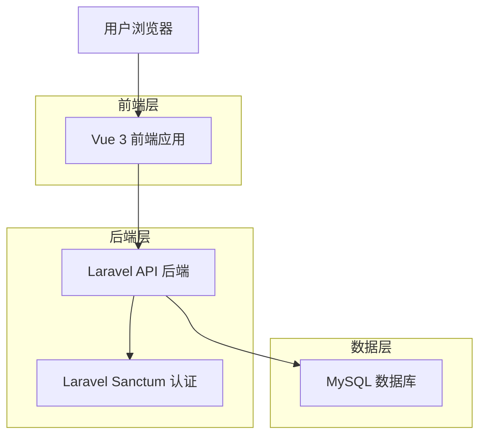
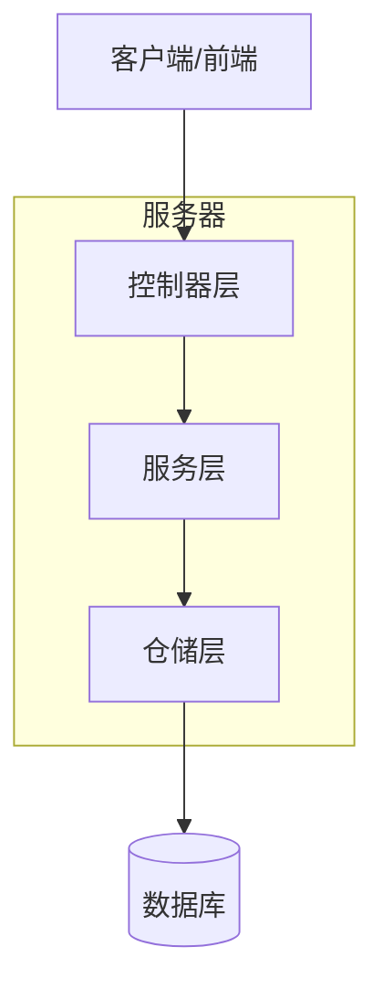
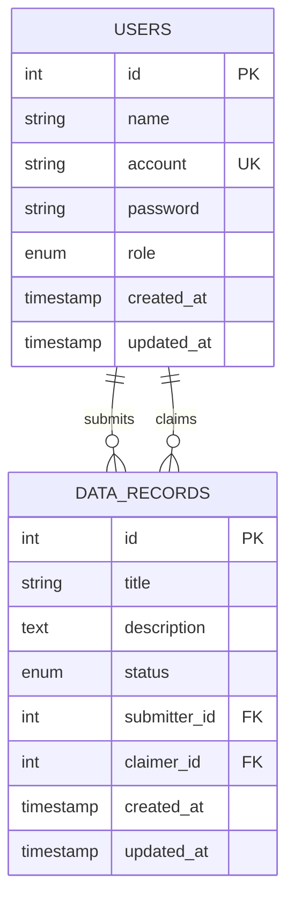

# 用户管理系统技术架构文档

## 1. 架构设计



## 2. 技术描述

- 前端：Vue 3 + Arco Design Vue + TypeScript + Vite
- 后端：Laravel 10 + PHP 8.1+ + Laravel Sanctum
- 数据库：MySQL 8.0+

## 3. 路由定义

| 路由 | 用途 |
|------|------|
| /admin/users | 用户管理页面，显示用户列表和管理功能 |
| /admin/users/create | 用户创建页面，新增用户账户 |
| /admin/users/:id | 用户详情页面，查看用户完整信息 |
| /admin/users/:id/edit | 用户编辑页面，修改用户信息 |
| /login | 登录页面，使用账户名进行身份验证 |

## 4. API定义

### 4.1 核心API

用户认证相关
```
POST /api/auth/login
```

请求：
| 参数名称 | 参数类型 | 是否必需 | 描述 |
|----------|----------|----------|------|
| account | string | true | 用户账户名 |
| password | string | true | 用户密码 |

响应：
| 参数名称 | 参数类型 | 描述 |
|----------|----------|------|
| status | boolean | 请求状态 |
| data | object | 用户信息和token |

示例
```json
{
  "account": "admin001",
  "password": "123456"
}
```

用户管理相关
```
GET /api/users
```

请求：
| 参数名称 | 参数类型 | 是否必需 | 描述 |
|----------|----------|----------|------|
| page | integer | false | 页码，默认为1 |
| per_page | integer | false | 每页数量，默认为10 |
| search | string | false | 搜索关键词 |
| role | string | false | 角色筛选 |

```
POST /api/users
```

请求：
| 参数名称 | 参数类型 | 是否必需 | 描述 |
|----------|----------|----------|------|
| name | string | true | 用户姓名 |
| account | string | true | 用户账户名 |
| password | string | true | 用户密码 |
| role | string | true | 用户角色 |

```
PUT /api/users/{id}
```

请求：
| 参数名称 | 参数类型 | 是否必需 | 描述 |
|----------|----------|----------|------|
| name | string | false | 用户姓名 |
| account | string | false | 用户账户名 |
| role | string | false | 用户角色 |

```
DELETE /api/users/{id}
```

```
DELETE /api/users/batch
```

请求：
| 参数名称 | 参数类型 | 是否必需 | 描述 |
|----------|----------|----------|------|
| ids | array | true | 用户ID数组 |

## 5. 服务器架构图



## 6. 数据模型

### 6.1 数据模型定义



### 6.2 数据定义语言

用户表 (users)
```sql
-- 修改用户表结构
ALTER TABLE users 
DROP COLUMN email,
DROP COLUMN email_verified_at,
ADD COLUMN account VARCHAR(100) UNIQUE NOT NULL COMMENT '用户账户名' AFTER name;

-- 创建索引
CREATE INDEX idx_users_account ON users(account);
CREATE INDEX idx_users_role ON users(role);

-- 更新现有数据（示例）
UPDATE users SET account = CONCAT('user', id) WHERE account IS NULL;

-- 初始化管理员数据
INSERT INTO users (name, account, password, role, created_at, updated_at) VALUES
('系统管理员', 'admin', '$2y$10$92IXUNpkjO0rOQ5byMi.Ye4oKoEa3Ro9llC/.og/at2.uheWG/igi', 'admin', NOW(), NOW()),
('测试用户', 'testuser', '$2y$10$92IXUNpkjO0rOQ5byMi.Ye4oKoEa3Ro9llC/.og/at2.uheWG/igi', 'user', NOW(), NOW());
```

用户控制器 (UserController)
```sql
-- 创建用户管理相关的权限记录（如果需要）
CREATE TABLE user_permissions (
    id BIGINT UNSIGNED AUTO_INCREMENT PRIMARY KEY,
    user_id BIGINT UNSIGNED NOT NULL,
    permission VARCHAR(100) NOT NULL,
    created_at TIMESTAMP NULL DEFAULT NULL,
    updated_at TIMESTAMP NULL DEFAULT NULL,
    FOREIGN KEY (user_id) REFERENCES users(id) ON DELETE CASCADE
);

-- 创建用户操作日志表
CREATE TABLE user_logs (
    id BIGINT UNSIGNED AUTO_INCREMENT PRIMARY KEY,
    user_id BIGINT UNSIGNED NOT NULL,
    action VARCHAR(100) NOT NULL COMMENT '操作类型',
    description TEXT COMMENT '操作描述',
    ip_address VARCHAR(45) COMMENT 'IP地址',
    user_agent TEXT COMMENT '用户代理',
    created_at TIMESTAMP NULL DEFAULT NULL,
    FOREIGN KEY (user_id) REFERENCES users(id) ON DELETE CASCADE
);

-- 创建索引
CREATE INDEX idx_user_logs_user_id ON user_logs(user_id);
CREATE INDEX idx_user_logs_action ON user_logs(action);
CREATE INDEX idx_user_logs_created_at ON user_logs(created_at DESC);
```