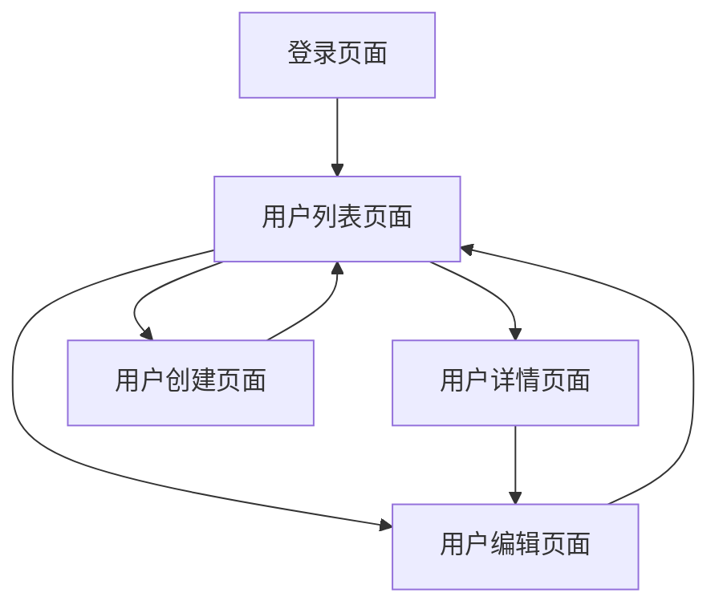

# 用户管理系统需求文档

## 1. 产品概述

本项目旨在优化现有的用户管理系统，通过改进用户表结构和新增用户管理API接口，提供更加完善的用户管理功能。系统将移除邮箱验证机制，改用账户名作为主要登录凭证，简化用户注册和登录流程。

主要目标是为管理员提供完整的用户CRUD操作功能，包括用户创建、查询、更新、删除等核心功能，同时保持系统的安全性和易用性。

## 2. 核心功能

### 2.1 用户角色

| 角色 | 注册方法 | 核心权限 |
|------|----------|----------|
| 管理员 | 系统预设或管理员创建 | 完整的用户管理权限，包括创建、查看、编辑、删除用户 |
| 普通用户 | 账户名注册 | 基本功能使用权限，可查看和修改个人信息 |

### 2.2 功能模块

用户管理系统包含以下主要页面：
1. **用户列表页面**：用户信息展示、搜索筛选、分页浏览
2. **用户详情页面**：查看用户完整信息
3. **用户编辑页面**：修改用户信息、角色管理
4. **用户创建页面**：新增用户账户

### 2.3 页面详情

| 页面名称 | 模块名称 | 功能描述 |
|----------|----------|----------|
| 用户列表页面 | 用户列表展示 | 分页显示所有用户，支持按账户名、姓名、角色搜索和筛选 |
| 用户列表页面 | 批量操作 | 支持批量删除用户，批量修改用户角色 |
| 用户详情页面 | 用户信息展示 | 显示用户完整信息，包括基本信息、角色、创建时间等 |
| 用户编辑页面 | 信息修改 | 修改用户姓名、账户名、角色等信息 |
| 用户编辑页面 | 密码管理 | 重置用户密码功能 |
| 用户创建页面 | 用户注册 | 创建新用户账户，设置基本信息和角色 |
| 登录页面 | 账户登录 | 使用账户名和密码进行登录认证 |

## 3. 核心流程

### 管理员流程
管理员登录系统后，可以访问用户管理功能，进行用户的增删改查操作。具体流程包括：查看用户列表 → 搜索筛选用户 → 查看用户详情 → 编辑用户信息 → 创建新用户 → 批量管理用户。

### 普通用户流程
普通用户通过账户名登录系统，主要进行个人信息管理：登录系统 → 查看个人信息 → 修改个人资料 → 修改密码。

## 4. 用户界面设计

### 4.1 设计风格

- **主色调**：蓝色系 (#1890ff) 作为主色，灰色系 (#f5f5f5) 作为背景色
- **按钮样式**：圆角按钮，主要操作使用实心按钮，次要操作使用线框按钮
- **字体**：系统默认字体，标题使用 16px，正文使用 14px，辅助文字使用 12px
- **布局风格**：卡片式布局，顶部导航栏，左侧菜单栏
- **图标风格**：使用 Arco Design 图标库，简洁现代的线性图标

### 4.2 页面设计概览

| 页面名称 | 模块名称 | UI元素 |
|----------|----------|--------|
| 用户列表页面 | 搜索筛选区 | 搜索框、角色筛选下拉框、重置按钮，背景色 #fafafa |
| 用户列表页面 | 数据表格 | 分页表格，行选择，操作按钮，斑马纹样式 |
| 用户列表页面 | 批量操作栏 | 批量删除按钮，批量角色修改，固定在表格上方 |
| 用户详情页面 | 信息展示卡片 | 用户头像、基本信息、角色标签，卡片阴影效果 |
| 用户编辑页面 | 表单区域 | 输入框、选择器、保存按钮，表单验证提示 |
| 用户创建页面 | 创建表单 | 账户名输入、姓名输入、角色选择、密码设置 |

### 4.3 响应式设计

系统采用桌面优先的响应式设计，支持平板和手机端访问。在移动端，侧边栏将收缩为抽屉式菜单，表格将支持横向滚动，确保在小屏幕设备上的良好用户体验。